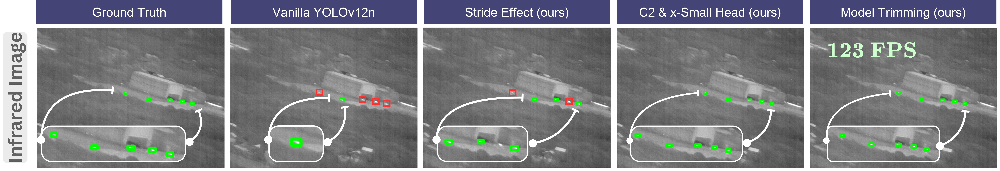

<h2 align="center">✈️ TY-RIST: Tactical YOLO Tricks for Real-time Infrared Small Target Detection</h2> 
<p align="center">
  <a href="https://www.linkedin.com/in/abdulkarimatrash"><strong>Abdulkarim Atrash</strong></a>
  ·
  <a href="https://www.linkedin.com/in/omar-moured/"><strong>Omar Moured</strong></a>
  ·
  <a href="https://scholar.google.com/citations?user=nG2ebe8AAAAJ&hl=en"><strong>Yufan Chen</strong></a>
  ·
  <a href="https://insailab.org/"><strong>Jiaming Zhang</strong></a>
  ·
  <a href=""><strong>Seyda Ertekin</strong></a>
  .
  <a href=""><strong>Omur Ugur</strong></a>
</p>

<p align="center">
  <a href="https://multispectral4ra.github.io/">
    
  </a>
  &nbsp;
  <a href="https://arxiv.org/abs/2509.22909">
    
  </a>
</p>

<p align="center">
  
</p>

<h4 align="center">🎉 Our paper has been accepted to the ICCV 2025 Workshop!</h4>

## 🧠 About

**TY-RIST** enhances detection models for real-time infrared small target detection (IRSTD) through multiple architectural tricks:  
(1) Stride-aware backbone, (2) High-resolution detection head, (3) Cascaded coordinate attention, (4) Branch pruning
Wel also used Normalized Gaussian Wasserstein Distance (NWD) for stable regression,

## ⚡ Performance  
**TY-RIST** achieves state-of-the-art results on 4 benchmarks: +7.9% mAP@0.5 IoU, +3% Precision, +10.2% Recall, and 123 FPS on a single GPU.

<p align="center">
  
</p>

## 🛠️ Usage
- For **research and academic purposes**, we provide access to the source code upon request. Please contact us at atrashabdulkarim@gmail.com 
- For **commercial use**, please contact us at moured.omar@gmail.com
  
## 📚 Citation
```bibtex
@misc{atrash2025tyristtacticalyolotricks,
      title={TY-RIST: Tactical YOLO Tricks for Real-time Infrared Small Target Detection}, 
      author={Abdulkarim Atrash and Omar Moured and Yufan Chen and Jiaming Zhang and Seyda Ertekin and Omur Ugur},
      year={2025},
      eprint={2509.22909},
      archivePrefix={arXiv},
      primaryClass={cs.CV},
      url={https://arxiv.org/abs/2509.22909}, 
}
```
